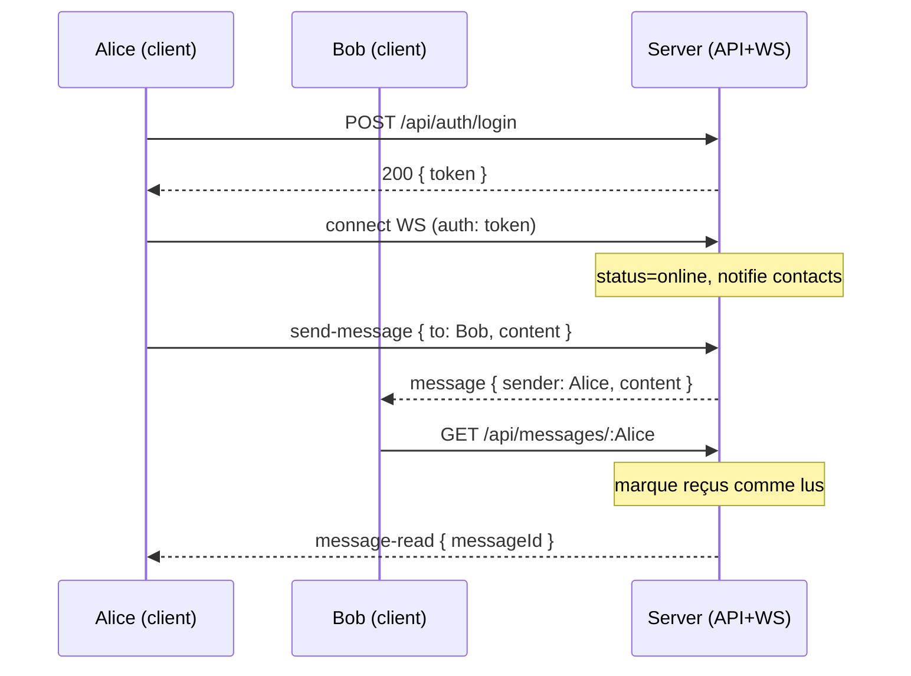

# Chat 1-to-1 (Express + Socket.IO + MongoDB)

Application de messagerie privée en temps réel avec API REST, WebSocket et client React (Vite).

## Sommaire
- Présentation
- Architecture & Tech stack
- Installation & Démarrage
- Variables d’environnement
- Frontend (React)
- API REST (endpoints)
- Événements WebSocket
- Diagramme de flux (Mermaid)
- Tests & Couverture
- Structure du projet
- Dépannage (FAQ)

---

## Présentation
- Chat 1-à-1 avec statuts (online/offline), “en train d’écrire…”, messages lus, édition/suppression, recherche d’utilisateurs.
- Authentification JWT (Bearer) pour l’API et la connexion Socket.IO.
- Persistance: MongoDB/Mongoose.

## Architecture & Tech stack
- Backend: Node.js, Express, Socket.IO, Mongoose, JWT, Bcrypt, dotenv
- Frontend: React + Vite (servi par Express en production)
- Tests: Mocha, Chai, Supertest, mongodb-memory-server, socket.io-client, nyc

## Installation & Démarrage

1. Cloner et installer
```powershell
npm install
```

2. Configurer l’environnement (copier `.env.example` vers `.env` et renseigner):
```
MONGODB_URI=mongodb://localhost:27017/websocket-mongo
JWT_SECRET=une_chaine_secrete
PORT=5000
```

3. Développement (API + WebSocket)
```powershell
npm run dev
```
- Backend: http://localhost:5000
- Front React (dev Vite, optionnel):
```powershell
cd client; npm install; npm run dev
```
- Front React (prod, servi par Express):
```powershell
cd client; npm run build
# Puis relancez le backend si nécessaire
```

4. Tests
```powershell
npm test
```

## Frontend (React)
- URL: http://localhost:5000 (prod) ou http://localhost:5173 (dev Vite)
- Pages: Login, Register, Chat, Profil, Changer le mot de passe
- Fonctionnalités: Conversations, Utilisateurs, recherche en temps réel, “typing…”, statut lu/non-lu, avatars (URL), édition/suppression de mes messages

## API REST
Toutes les routes (sauf `register` et `login`) nécessitent un header `Authorization: Bearer <token>`.

### Auth
- POST `/api/auth/register`
  - body: `{ email, password, [username], [avatar] }`
  - 201: `{ token, user: { id, email, username, avatar, status } }`
- POST `/api/auth/login`
  - body: `{ email, password }`
  - 200: `{ token, user }`
- POST `/api/auth/logout`
  - 200: `{ ok: true }`

### Utilisateurs
- GET `/api/users/:id` (public)
  - 200: `{ id, username, avatar, status }`
- GET `/api/users`
  - query: `page=1&limit=20`
  - 200: `{ total, page, pageSize, data: [ { _id, username, avatar, status, lastLogin } ] }`
- PUT `/api/users/profile`
  - body: `{ username?, avatar?(url|""), email? }`
  - 200: `{ id, email, username, avatar, status }`
- PUT `/api/users/password`
  - body: `{ currentPassword, newPassword }` (min 6)
  - 200: `{ ok: true }`
- GET `/api/users/search`
  - query: `q=<texte>`
  - 200: `{ total, page, pageSize, data: [...] }`

### Messages
- POST `/api/messages`
  - body: `{ recipient_id, content }` (max 5000)
  - 201: `Message`
- GET `/api/messages/:user_id`
  - query: `page=1`
  - 200: `{ total, page, pageSize, data: [Message] }` (tri desc; UI inverse pour affichage asc)
  - Effet: marque les messages reçus comme lus
- GET `/api/conversations`
  - 200: `[{ other: { id, username, avatar, status, lastLogin }, lastMessage: {...}, unreadCount }]`
- PUT `/api/messages/:id`
  - body: `{ content }`
  - 200: `Message` (marqué `edited: true`)
- DELETE `/api/messages/:id`
  - 200: `{ ok: true }` (soft delete)
- POST `/api/messages/:id/read`
  - 200: `{ ok: true }`

Exemples (PowerShell / curl)
```powershell
# Inscription
curl -Method POST -Uri http://localhost:5000/api/auth/register -Body '{"email":"a@b.c","password":"secret"}' -ContentType 'application/json'

# Login
$resp = curl -Method POST -Uri http://localhost:5000/api/auth/login -Body '{"email":"a@b.c","password":"secret"}' -ContentType 'application/json'
$token = ($resp.Content | ConvertFrom-Json).token

# Lister les conversations
curl -H "Authorization: Bearer $token" http://localhost:5000/api/conversations
```

## Événements WebSocket (Socket.IO)
Connexion: auth par `token` dans `io('/', { auth: { token }})`.

- `send-message` (client → serveur)
  - payload: `{ to: <userId>, content: <string> }`
  - ack success: `{ ok: true, id }`, ack error: `{ ok: false, code, message }`
- `message` (serveur → destinataire)
  - `{ _id, sender, recipient, content, status, createdAt }`
- `message-read` (client → serveur, puis serveur → expéditeur)
  - payload: `{ messageId }`; notification: `{ messageId }`
- `typing` (client → serveur → destinataire)
  - payload: `{ to: <userId>, typing: boolean }`; notification: `{ from: <userId>, typing: boolean }`
- `user-online` / `user-offline`
  - `{ userId }` / `{ userId, lastLogin }`
- `user-status` (client → serveur, callback)
  - cb: `{ ok: true, users: [{ id, username, status, lastLogin }] }`

Sécurité & portée
- Auth obligatoire (JWT) à la connexion.
- Diffusion limitée aux “contacts” (utilisateurs avec conversation existante).

## Diagramme de flux (Mermaid)


## Tests & Couverture
- Lancer les tests: `npm test`
- Outils: Mocha, Chai, Supertest, mongodb-memory-server, socket.io-client, nyc
- Objectif: couverture ≥ 80% (ajouter des tests si nécessaire)

## Structure du projet
```
src/
  app.js, server.js
  controllers/{authController.js,userController.js,messageController.js}
  middleware/auth.js
  models/{User.js,Message.js}
  routes/{auth.js,users.js,messages.js}
  socket/handlers.js
client/
  index.html, vite.config.js, package.json
  src/{main.jsx, styles.css}
  src/pages/{Login.jsx, Register.jsx, Chat.jsx, Profile.jsx, ChangePassword.jsx}
  src/components/{Avatar.jsx, ConversationList.jsx, MessageList.jsx, Composer.jsx, UserList.jsx}
  src/services/{api.js, auth.js, socket.js}
```

## Dépannage (FAQ)
- 404 sur http://localhost:5000: Construire le front (`cd client; npm run build`) et relancer le serveur.
- 401 API: vérifier le header Authorization (Bearer) et le token.
- `JWT_SECRET` manquant: définir dans `.env`.
- Pas de collections Mongo: elles apparaissent après la première insertion (ou utiliser un script de seed).
